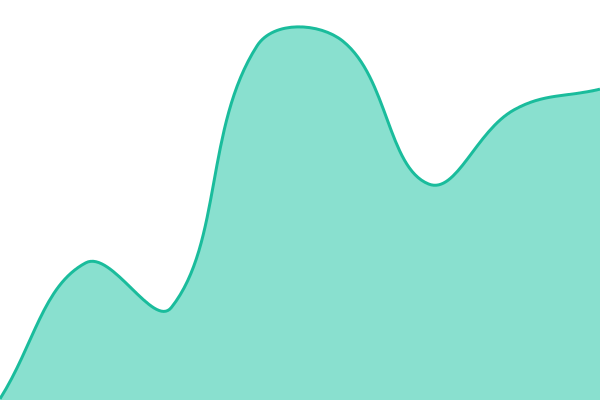
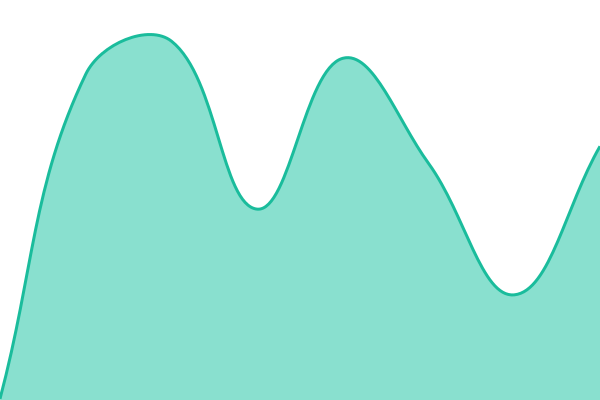

# [📈 Live Status](https://TexasDroneCompany.github.io/status.txdroneco.com): <!--live status--> **🟩 All systems operational**

This repository contains the open-source uptime monitor and status page for [Texas Drone Company](https://www.txdroneco.com), powered by [Upptime](https://github.com/upptime/upptime).

With [Upptime](https://upptime.js.org), you can get your own unlimited and free uptime monitor and status page, powered entirely by a GitHub repository. We use [Issues](https://github.com/TexasDroneCompany/status.txdroneco.com/issues) as incident reports, [Actions](https://github.com/TexasDroneCompany/status.txdroneco.com/actions) as uptime monitors, and [Pages](https://TexasDroneCompany.github.io/status.txdroneco.com) for the status page.

<!--start: status pages-->
<!-- This summary is generated by Upptime (https://github.com/upptime/upptime) -->
<!-- Do not edit this manually, your changes will be overwritten -->
<!-- prettier-ignore -->
| URL | Status | History | Response Time | Uptime |
| --- | ------ | ------- | ------------- | ------ |
|  [DroneVision Portal](https://dronevision.txdroneco.com/login) | 🟩 Up | [drone-vision-portal.yml](https://github.com/TexasDroneCompany/status.txdroneco.com/commits/HEAD/history/drone-vision-portal.yml) | 

 376ms
     
 | 

<a href="https://status.txdroneco.com/history/drone-vision-portal">100.00%</a>
    

|  [Map Tiles (txTiler)](https://txtiler.txdroneco.com) | 🟩 Up | [map-tiles-tx-tiler.yml](https://github.com/TexasDroneCompany/status.txdroneco.com/commits/HEAD/history/map-tiles-tx-tiler.yml) | 

 232ms
     
 | 

<a href="https://status.txdroneco.com/history/map-tiles-tx-tiler">100.00%</a>
    

|  [Photo Packager](https://txtiler.txdroneco.com/packager/health) | 🟩 Up | [photo-packager.yml](https://github.com/TexasDroneCompany/status.txdroneco.com/commits/HEAD/history/photo-packager.yml) | 

 359ms
     
 | 

<a href="https://status.txdroneco.com/history/photo-packager">100.00%</a>
    

|  [ODM Processing](https://odm.txdroneco.com/health) | 🟩 Up | [odm-processing.yml](https://github.com/TexasDroneCompany/status.txdroneco.com/commits/HEAD/history/odm-processing.yml) | 

 226ms
     
 | 

<a href="https://status.txdroneco.com/history/odm-processing">100.00%</a>
    

|  [Supabase API](https://uhlfqorijoabyzjhhsdo.supabase.co/auth/v1/health) | 🟩 Up | [supabase-api.yml](https://github.com/TexasDroneCompany/status.txdroneco.com/commits/HEAD/history/supabase-api.yml) | 

 104ms
     
 | 

<a href="https://status.txdroneco.com/history/supabase-api">100.00%</a>
    

<!--end: status pages-->

[**Visit our status website →**](https://TexasDroneCompany.github.io/status.txdroneco.com)

## 📄 License

- Powered by: [Upptime](https://github.com/upptime/upptime)
- Code: [MIT](./LICENSE) © [Anand Chowdhary](https://anandchowdhary.com)
- Data in the `./history` directory: [Open Database License](https://opendatacommons.org/licenses/odbl/1-0/)
